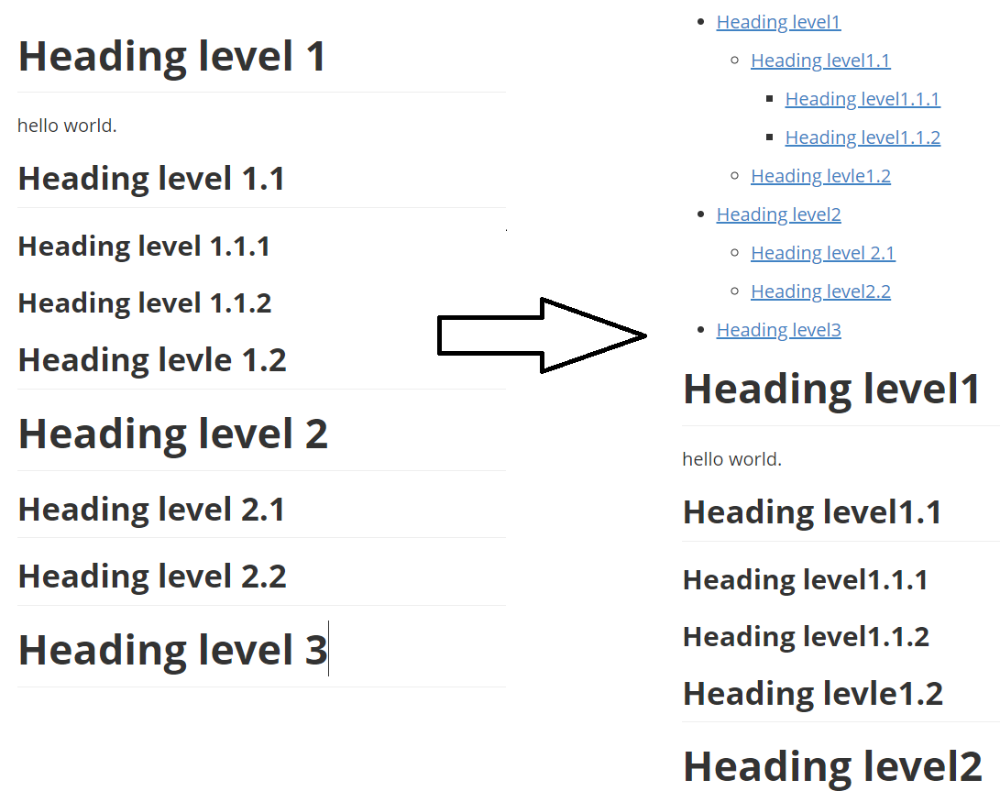

# GitToc

为你的Github仓库的Readme自动生成一个目录

[English readme](README.md)

## 简介

如下是转换效果：



转换后的目录支持业内跳转

## 使用教程

假设你的目标文件名为 `targetFile.md`. 在你的命令行下键入下面命令即可:

 ```shell
> python targetFile.md
 ```

你会在你的当前目录下获得一个名为 `targetFile_with_toc.md` 的文件